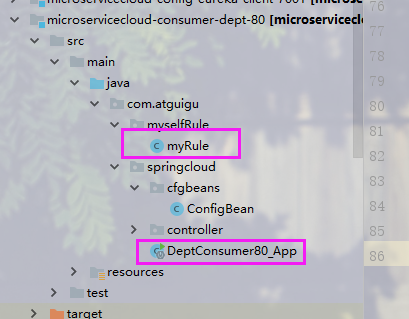

# 关于我对这次微服务案列的理解  

-------
## 脑图已经奉上  

## 1.总项目的开始
### 1.1 最开始构建了一个maven父项目让其他的项目来继承
* 1. 做了一个公共的模块microservicecloud-api  
* 1. src 里面主要封装了所有部门微服务所需的javabean
* 2. 其次是用Feign做负载均衡时的抽象服务层以及服务降级（暂停服务）的
备选（fallbackFactory）服务
* 3. pom 文件是整体的全部配置


##  2.eureka服务注册的搭建
### 2.1 新建eureka7001（单个eureka）:  
* 2.1.1. pom文件主要添加了:  
```xml
<dependency>
         <groupId>org.springframework.cloud</groupId>
         <artifactId>spring-cloud-starter-eureka-server</artifactId>
</dependency>
```
注意server，是服务端的配置  

* 2.1.2 src :  
主启动类要添加@EnableEurekaServer开启eureka服务  

* 2.1.3 配置文件:  
```yaml
server:
      port: 7001
    eureka:
      instance:
        hostname: eureka7001.com
      client:
        register-with-eureka: false
        fetch-registry: false
        能提供服务的地址（包括自己），集群的eureka
        service-url:
          defaultZone: http://${eureka.instance.hostname}:${server.port}/eureka/ 
```
### 2.2 新建eureka7001（集群eureka）:   
* 主要是yml配置文件的改变  
```yaml
server:
  port: 7001
eureka:
  instance:
    hostname: eureka7001.com
  client:
    register-with-eureka: false
    fetch-registry: false
#    能提供服务的地址（包括自己），集群的eureka
    service-url:
      defaultZone: http://eureka7002.com:7002/eureka/,http://eureka7003.com:7003/eureka/
```
### 2.3 eureka搭载好后，消费者和服务提供商的访问:  
 **做个一个8001的dept服务提供者和一个80端口的消费者，
 通过在80消费者端口配置restTemplate调用服务提供商的地址
 来进行访问**

##  3.ribbon负载均衡：
* 3.1 pom文件:  
80端口消费者添加对ribbon的依赖  
```xml
<!-- Ribbon相关 -->
        <dependency>
            <groupId>org.springframework.cloud</groupId>
            <artifactId>spring-cloud-starter-eureka</artifactId>
        </dependency>
``` 
* 3.2 src主启动类:  
开启ribbon
```java
@RibbonClient(name ="MICROSERVICECLOUD-DEPT",configuration = myRule.class )
```
开启负载均衡：在配置restTemplate时加上@LoadBalanced

ribbon可以自定义负载均衡算法  
```java
@Configuration

public class myRule
{
    @Bean
    public IRule mySelfRule(){
        return new RandomRule();
    }
}
```
注意自定义算法规则的类的级别要和主启动类是一个级别


##  3.feign负载均衡：
### 3.1 公共模块 api 的改变:  
* 添加feign依赖
```xml
<dependency>
            <groupId>org.springframework.cloud</groupId>
            <artifactId>spring-cloud-starter-feign</artifactId>
        </dependency>
```
* 新建公共接口（3个服务提供商共有的接口）：  
并且在接口上标注@feign注解
  
指明为那个微服务提供feign，

### 3.2 新建一个80端口的消费者:
* 1. pom文件添加feign依赖
```xml
<dependency>
            <groupId>org.springframework.cloud</groupId>
            <artifactId>spring-cloud-starter-feign</artifactId>
        </dependency>
```
* 2. 主启动类开启feign客服端:@EnableFeignClients(basePackages = {"com.atguigu.springcloud"})  
扫描公共子模块api里的定义的feign接口
* 3. 配置文件application.yml开启feign负载均衡  
```yaml
feign:
  hystrix:
    enabled: true
```
