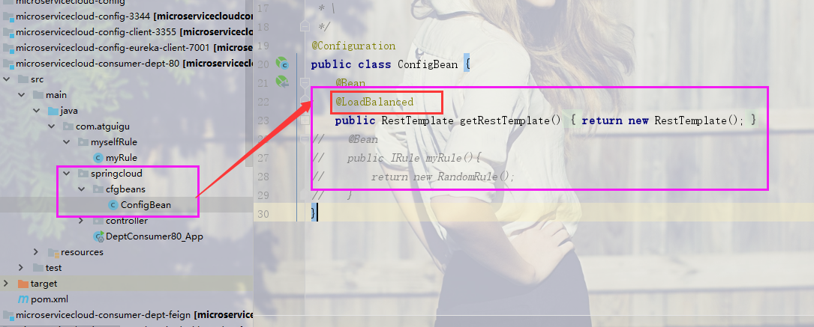
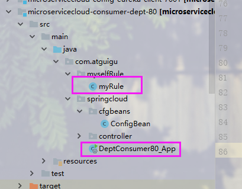

# 关于我对这次微服务案列的理解  

-------
## 脑图已在项目中

## 1.总项目的开始
### 1.1 最开始构建了一个maven父项目让其他的项目来继承  

### 1.2 做了一个公共的模块microservicecloud-api  
* 1. src 里面主要封装了所有部门微服务所需的javabean
* 2. 其次是用Feign做负载均衡时的抽象服务层以及服务降级（暂停服务）的
备选（fallbackFactory）服务
* 3. pom 文件是整体的全部配置


##  2.eureka服务注册的搭建
### 2.1 新建eureka7001（单个eureka）:  
* 2.1.1. pom文件主要添加了:  
```xml
<dependency>
         <groupId>org.springframework.cloud</groupId>
         <artifactId>spring-cloud-starter-eureka-server</artifactId>
</dependency>
```
注意server，是服务端的配置  

* 2.1.2 src :  
主启动类要添加@EnableEurekaServer开启eureka服务  

* 2.1.3 配置文件:  
```yaml
server:
      port: 7001
    eureka:
      instance:
        hostname: eureka7001.com
      client:
        register-with-eureka: false
        fetch-registry: false
        能提供服务的地址（包括自己），集群的eureka
        service-url:
          defaultZone: http://${eureka.instance.hostname}:${server.port}/eureka/ 
```
### 2.2 新建eureka7001（集群eureka）:   
* 主要是yml配置文件的改变  
```yaml
server:
  port: 7001
eureka:
  instance:
    hostname: eureka7001.com
  client:
    register-with-eureka: false
    fetch-registry: false
#    能提供服务的地址（包括自己），集群的eureka
    service-url:
      defaultZone: http://eureka7002.com:7002/eureka/,http://eureka7003.com:7003/eureka/
```
### 2.3 eureka搭载好后，消费者和服务提供商的访问:  
 **做个一个8001的dept服务提供者和一个80端口的消费者，
 通过在80消费者端口配置restTemplate调用服务提供商的地址
 来进行访问**

##  3.ribbon负载均衡：
* 3.1 pom文件:  
80端口消费者添加对ribbon的依赖  
```xml
<!-- Ribbon相关 -->
        <dependency>
            <groupId>org.springframework.cloud</groupId>
            <artifactId>spring-cloud-starter-eureka</artifactId>
        </dependency>
``` 
* 3.2 src主启动类:  
开启ribbon
```java
@RibbonClient(name ="MICROSERVICECLOUD-DEPT",configuration = myRule.class )
```
开启负载均衡：在配置restTemplate时加上@LoadBalanced

ribbon可以自定义负载均衡算法  
```java
@Configuration

public class myRule
{
    @Bean
    public IRule mySelfRule(){
        return new RandomRule();
    }
}
```
注意自定义算法规则的类的级别要和主启动类是一个级别


##  3.feign负载均衡：
### 3.1 公共模块 api 的改变:  
* 添加feign依赖
```xml
<dependency>
            <groupId>org.springframework.cloud</groupId>
            <artifactId>spring-cloud-starter-feign</artifactId>
        </dependency>
```
* 新建公共接口（3个服务提供商共有的接口）：  
并且在接口上标注@feign注解
  
指明为那个微服务提供feign负载均衡，

### 3.2 新建一个80端口的消费者:
* 1. pom文件添加feign依赖
```xml
<dependency>
            <groupId>org.springframework.cloud</groupId>
            <artifactId>spring-cloud-starter-feign</artifactId>
        </dependency>
```
* 2. 主启动类开启feign客服端:@EnableFeignClients(basePackages = {"com.atguigu.springcloud"})  
扫描公共子模块api里的定义的feign接口
* 3. 配置文件application.yml开启feign负载均衡  
```yaml
feign:
  hystrix:
    enabled: true
```
##  4.hystrix熔断器： 

### 4.1 服务熔断:      
* pom文件主要添加对hystrix的依赖  
```xml
<dependency>
            <groupId>org.springframework.cloud</groupId>
            <artifactId>spring-cloud-starter-hystrix</artifactId>
        </dependency>
```
* src 主启动类添加：@EnableCircuitBreaker开启熔断器  
controller层做好熔断处理@HystrixCommand(fallbackMethod = "processHystrix_Get")
  

### 4.2 服务降级: 
* 在 ***3.feign负载均衡***的基础上，如下图
  
添加fallbackFactory备选事件，  
当某个微服务提供被暂停时，触发备选服务（DeptClientServiceFallbackFactory）

## 5 hystrix监控：  
***重点***:  要想每个微服务被监控，每个微服务必须在pom添加  
```xml
<dependency>
            <groupId>org.springframework.boot</groupId>
            <artifactId>spring-boot-starter-actuator</artifactId>
        </dependency>
```
使改微服务能够被外界监控
### 5.1 hystrix -dashboard:  
* 新建microservicecloud-consumer-hystrix-dashboard工程  
* pom文件添加：  
```xml
<dependency>
            <groupId>org.springframework.cloud</groupId>
            <artifactId>spring-cloud-starter-hystrix</artifactId>
        </dependency>
        <dependency>
            <groupId>org.springframework.cloud</groupId>
            <artifactId>spring-cloud-starter-hystrix-dashboard</artifactId>
        </dependency>
```
* 主启动类添加@EnableHystrixDashboard注解开启仪表盘

## 6. zuul网关:  
新建microservicecloud-zuul-gateway-9527工程:   

* pom文件添加zull,zull也要被注册到eureka中 
```xml
        <dependency>
            <groupId>org.springframework.cloud</groupId>
            <artifactId>spring-cloud-starter-zuul</artifactId>
        </dependency>

        <dependency>
            <groupId>org.springframework.cloud</groupId>
            <artifactId>spring-cloud-starter-eureka</artifactId>
        </dependency>
        <!-- actuator监控 -->
        <dependency>
            <groupId>org.springframework.boot</groupId>
            <artifactId>spring-boot-starter-actuator</artifactId>
        </dependency>
        <!-- hystrix容错 -->
        <dependency>
            <groupId>org.springframework.cloud</groupId>
            <artifactId>spring-cloud-starter-hystrix</artifactId>
        </dependency>
        <dependency>
            <groupId>org.springframework.cloud</groupId>
            <artifactId>spring-cloud-starter-config</artifactId>
        </dependency>
```
* 主启动类@EnableZuulProxy开启网管关理
* application配置文件
```yaml
server:
  port: 9527

spring:
  application:
    name: microservicecloud-zuul-gateway

eureka:
  client:
    service-url:
      defaultZone: http://eureka7001.com:7001/eureka,http://eureka7002.com:7002/eureka,http://eureka7003.com:7003/eureka
  instance:
    instance-id: gateway-9527.com
    prefer-ip-address: true


zuul:
  #ignored-services: microservicecloud-dept
  prefix: /atguigu
  ignored-services: "*"
  routes:
    mydept.serviceId: microservicecloud-dept
    mydept.path: /mydept/**

info:
  app.name: atguigu-microcloud
  company.name: www.atguigu.com
  build.artifactId: $project.artifactId$
  build.version: $project.version$
```
    mydept.serviceId: microservicecloud-dept
    mydept.path: /mydept/**
***mydept.serviceId: microservicecloud-dept**这个微服务的访问为  
prefix: /atguigu 加上 mydept.path: /mydept/**也就是（../atguigu/mydept/..）   
ignored-services: "*"真微服务的访问名被弃用


## 7.config配置中心:  
### 7.1 大管家 -中心config
新建 microservice-config-3344
* pom文件
```xml
<dependency>
            <groupId>org.springframework.cloud</groupId>
            <artifactId>spring-cloud-config-server</artifactId>
        </dependency>
```  
注意中心配置文件为 <artifactId>spring-cloud-config-server</artifactId>要加上server
* 主启动类 @EnableConfigServer开启中心配置文件  

* application.yml  
```yaml
server:
  port: 3344
spring:
  application:
    name: microservicecloud-config
  cloud:
    config:
      server:
        git:
          uri: https://github.com/LJIDWSYAM/microservicecloud-config.git
          username: LJIDWSYAM
          password: WHNABQ1980621312
```
配置你配置文件存放在github上的库的位置，***其他的分布式配置文件***  
都必须通过这个库取到配置文件

### 7.2 分布式配置文件:  
  
新建microservicecloud-config-eureka-client-7001  
* pom文件 
```xml
<dependency>
            <groupId>org.springframework.cloud</groupId>
            <artifactId>spring-cloud-starter-config</artifactId>
        </dependency>
```
*** 注意与  7.1 大管家 -中心config ***的pom文件的区别
一个是server一个是不带server
* 主启动类没有什么变化和正常的7001一样
* 配置文件：   
1. application.yml,配置简单的本微服务的名称
```yaml
spring:
  application:
    name: microservicecloud-config-eureka-client
```
2. bootstrap.yml最高级别的配置文件，覆盖其他的
```yaml
spring:
  cloud:
    config:
      name: microservicecloud-config-eureka-client     #需要从github上读取的资源名称，注意没有yml后缀名
      profile: dev
      label: master
      uri: http://config-3344.com:3344      #SpringCloudConfig获取的服务地址
```
name: microservicecloud-config-eureka-client  ，为通过中心配置文件到达github库上要用的那个配置的名字  
uri: http://config-3344.com:3344 从哪里取配置文件，此为中心配置文件的地址，通过这个地址找到github的  
配置文件的库，从库里取spring:
             cloud:
               config:
                 name: microservicecloud-config-eureka-client 
                 这个配置文件
  
profile: dev 要用的环境 （dev，test等）
      label: master  从那个分支取配置文件一般为主分支
 
  
